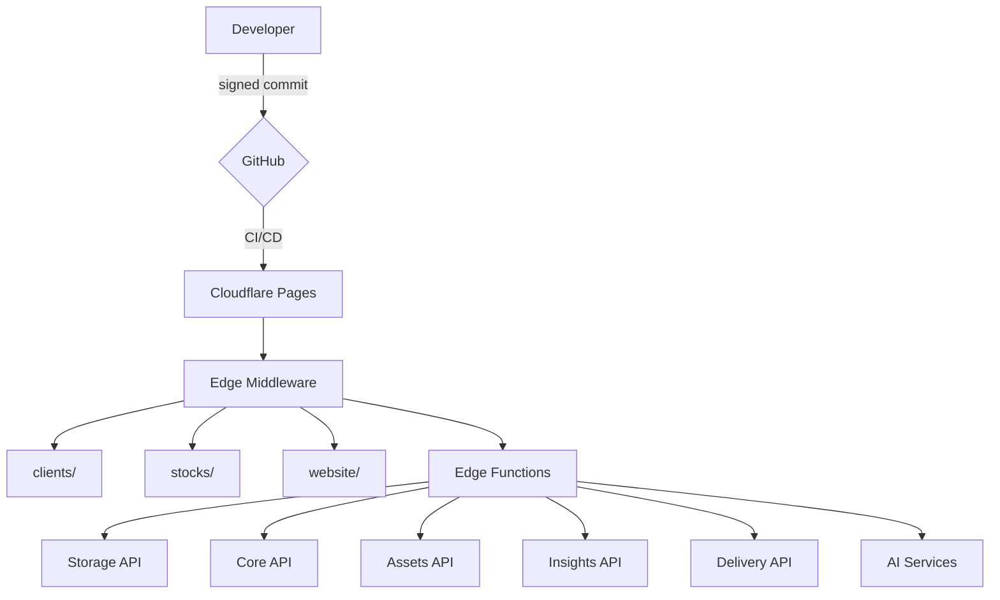

<p align="center">
  
</p>

<h1 align="center">CloudCDN</h1>

<p align="center">
  <strong>Enterprise-grade static asset delivery on Cloudflare's global edge network. Sub-100ms TTFB across 300+ PoPs.</strong>
</p>

<p align="center">
  <a href="https://github.com/sebastienrousseau/cloudcdn.pro/actions"></a>
  <a href="https://cloudcdn.pro"></a>
  <a href="https://cloudcdn.pro/api-reference"></a>
  <a href="LICENSE"></a>
</p>

---

## Overview

CloudCDN is a multi-tenant CDN platform built entirely on Cloudflare Workers, Pages, KV, Vectorize, and Workers AI. A single SVG upload scaffolds a complete project directory. Every image is optimized, cached at the edge, and served in under 100ms globally.

- **54 tenant zones** with isolated `v1/` directory structures
- **1,400+ optimized assets** — single source per image, derivatives on demand
- **12 edge API endpoints** across 6 planes (Storage, Core, Assets, Insights, Delivery, AI)
- **2,000 tests** with 100% statement/branch/function/line coverage
- **Signed commits** enforced end-to-end — from developer machine to edge deployment

## Architecture



```
/
├── clients/          54 tenant asset directories
├── stocks/           Global stock media (images, diagrams, videos)
├── website/          Application layer (dashboard, docs, scripts)
├── functions/        Cloudflare edge functions (middleware + 12 APIs)
├── manifest.json     Auto-generated asset registry
└── wrangler.toml     Cloudflare bindings (AI, Vectorize, KV)
```

## Features

| | |
| :--- | :--- |
| **Edge Delivery** | Static assets served from 300+ Cloudflare data centers with immutable 1-year cache headers and automatic CORS. |
| **Image Transforms** | On-the-fly resize, format conversion, blur, and sharpen via `/api/transform`. Supports WebP, AVIF, PNG, JPEG. |
| **Format Negotiation** | `/api/auto` reads the browser `Accept` header and serves the optimal format (AVIF > WebP > PNG) automatically. |
| **Signed URLs** | HMAC-SHA256 time-limited URLs for protected assets with constant-time signature verification. |
| **HLS Streaming** | Adaptive bitrate video delivery via HTTP Live Streaming playlists and byte-range segmentation. |
| **Semantic Search** | Natural language asset search powered by Workers AI embeddings and Vectorize vector similarity. |
| **AI Concierge** | RAG-powered chat assistant with SSE streaming, confidence scoring, and follow-up suggestions. |
| **Asset Pipeline** | Upload a single SVG → automatic directory scaffold with PWA icons, banners, and favicon. |
| **Zone Management** | Create, delete, and configure tenant zones via GitOps commits through the Core API. |
| **Edge Analytics** | Real-time request tracking, bandwidth monitoring, cache ratio, geo distribution, and error tracking. |
| **Cache Purge** | Instant invalidation by URL, surrogate tag (`Cache-Tag`), or full purge via the Cloudflare API. |
| **Dashboard** | Protected asset browser with faceted search, transform builder, insights charts, and upload pipeline. |

## API

Six distinct planes with strict authentication separation:

| Plane | Prefix | Auth | Description |
| :--- | :--- | :--- | :--- |
| **Storage** | `/api/storage/` | AccessKey | Upload, download, delete, batch operations |
| **Core** | `/api/core/` | AccountKey | Zones, domains, edge rules, statistics |
| **Assets** | `/api/assets` | AccessKey | Paginated catalog, per-asset metadata |
| **Insights** | `/api/insights/` | Any key | Summary, top assets, geography, errors |
| **Delivery** | `/api/transform` `/api/auto` `/api/signed` `/api/stream` `/api/purge` | Public | Edge transforms, format negotiation, signed URLs, HLS, cache |
| **AI** | `/api/search` `/api/chat` | Public | Semantic search, RAG concierge |

Interactive reference with Try It console: **[cloudcdn.pro/api-reference](https://cloudcdn.pro/api-reference)**

## Install

```bash
git clone https://github.com/sebastienrousseau/cloudcdn.pro.git
cd cloudcdn.pro
npm ci
```

## First 5 Minutes

```bash
# Start local development server
wrangler pages dev .

# Run the full test suite (2,000 tests)
npm test

# Generate the asset manifest
npm run build:manifest

# Build the dashboard CSS
npm run build:css
```

<details>
<summary><strong>Upload your first asset</strong></summary>

```bash
# Upload via the Storage API
curl -X PUT -H "AccessKey: YOUR_KEY" \
  -H "Content-Type: image/svg+xml" \
  -T ./logo.svg \
  https://cloudcdn.pro/api/storage/clients/myproject/v1/logos/logo.svg

# Or use the Asset Pipeline to scaffold a full directory
curl -X POST -H "AccountKey: YOUR_KEY" \
  -H "Content-Type: application/json" \
  -d '{ "mode": "client", "name": "myproject", "svg": "<base64>" }' \
  https://cloudcdn.pro/api/pipeline
```

</details>

<details>
<summary><strong>Transform an image on the fly</strong></summary>

```bash
# Resize to 400px WebP
curl 'https://cloudcdn.pro/api/transform?url=/myproject/v1/logos/logo.svg&w=400&format=webp'

# Generate a blur placeholder
curl 'https://cloudcdn.pro/api/transform?url=/myproject/v1/logos/logo.svg&w=32&q=1&blur=20'

# Auto-negotiate format (no auth needed)
curl 'https://cloudcdn.pro/api/auto?path=/myproject/v1/logos/logo'
```

</details>

## Environment Variables

| Variable | Description |
| :--- | :--- |
| `ACCOUNT_KEY` | Core API authentication (admin) |
| `STORAGE_KEY` | Storage API authentication (files) |
| `DASHBOARD_PASSWORD` | Dashboard login |
| `GITHUB_TOKEN` | GitOps mutations (upload/delete) |
| `GITHUB_REPO` | Repository for Git-based storage |
| `CLOUDFLARE_ACCOUNT_ID` | Custom domains, analytics |
| `CLOUDFLARE_API_TOKEN` | Cache purge, domains |
| `CLOUDFLARE_ZONE_ID` | Cache invalidation |
| `SIGNED_URL_SECRET` | HMAC signed URL generation |

## Testing

```bash
npm test                # 2,000 tests across 50 suites
npm run test:coverage   # 100% statement/branch/function/line
npm run test:visual     # Playwright visual regression (10 screenshots)
npm run test:load       # k6 load test (1,000 VUs)
npm run test:audit      # npm dependency security audit
```

<details>
<summary><strong>Test suite breakdown</strong></summary>

| Category | Suites | Tests |
| :--- | :--- | :--- |
| Endpoint unit tests | 14 | 600+ |
| Domain regression (Data/Control/Edge) | 13 | 250+ |
| Cross-cutting (auth, CORS, pagination, streaming) | 13 | 250+ |
| OpenAPI spec validation | 2 | 500+ |
| Infrastructure (manifest, client libs) | 8 | 400+ |
| **Total** | **50** | **2,000** |

</details>

## Security

- **Timing-safe HMAC** — XOR-based constant-time comparison on all signature verifications
- **Fail-closed auth** — production endpoints deny access when secrets are not configured
- **Path traversal hardened** — URL decoding, null byte rejection, `.git` blocking
- **CSP headers** — per-section Content-Security-Policy on dashboard, dist, and API reference
- **HSTS preload** — `Strict-Transport-Security: max-age=31536000; includeSubDomains; preload`
- **SHA-pinned Actions** — all GitHub Actions pinned by commit hash
- **Signed commits** — every deployment verified via GitHub API before reaching the edge

## Scripts

| Command | Description |
| :--- | :--- |
| `npm run build:manifest` | Rebuild `manifest.json` + TypeScript definitions |
| `npm run build:css` | Rebuild dashboard Tailwind CSS |
| `node website/scripts/prune-icons.mjs` | Remove legacy icon variants |
| `node website/scripts/prune-formats.mjs` | Keep single source per image |
| `node website/scripts/generate-client-libs.mjs` | Generate API client libraries (JS, TS, Python, cURL) |
| `node website/scripts/index-assets.mjs` | Build Vectorize embeddings for semantic search |
| `node website/scripts/patch-openapi.mjs` | Patch OpenAPI spec with missing response codes |

## Deployment

Pushes to `main` trigger automatic deployment via Cloudflare Pages:

1. **Verify signatures** — every commit must be cryptographically signed
2. **Deploy to edge** — `wrangler pages deploy` across 300+ PoPs
3. **Compress images** — auto-generate WebP/AVIF from new PNGs (signed commit)
4. **Regenerate manifest** — update asset registry via GitHub API (signed commit)

## License

The project is dual-licensed under the terms of both the [MIT license](LICENSE) and the [Apache License (Version 2.0)](http://www.apache.org/licenses/LICENSE-2.0).

## Acknowledgements

Built by [Sebastien Rousseau](https://github.com/sebastienrousseau) on [Cloudflare Workers](https://workers.cloudflare.com/), [Pages](https://pages.cloudflare.com/), [KV](https://developers.cloudflare.com/kv/), [Vectorize](https://developers.cloudflare.com/vectorize/), and [Workers AI](https://developers.cloudflare.com/workers-ai/).
