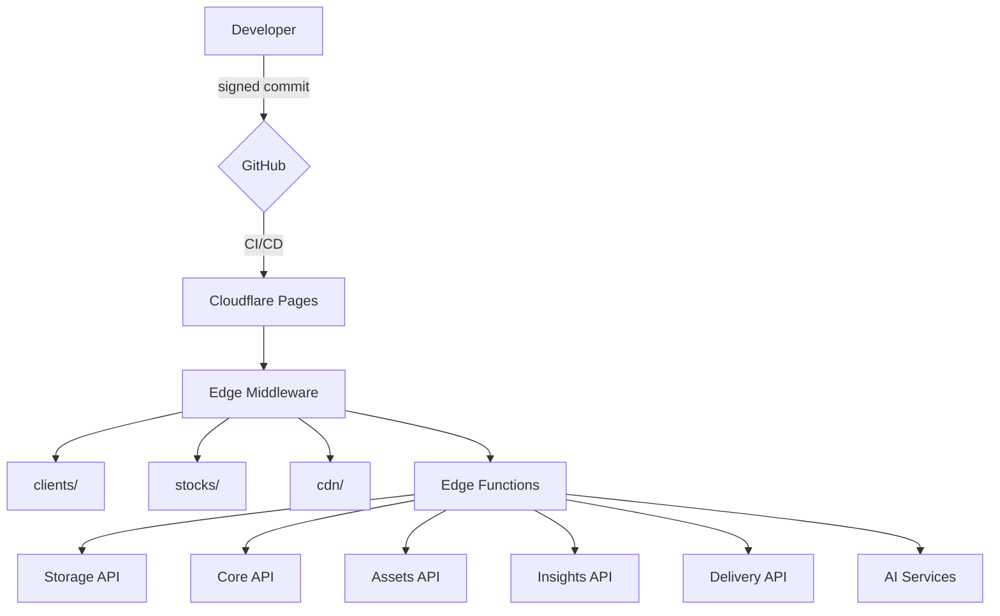

<p align="center">
  
</p>

<h1 align="center">CloudCDN</h1>

<p align="center">
  <strong>The multi-tenant, AI-native CDN you can read end-to-end and deploy yourself. Sub-100ms TTFB across 300+ Cloudflare PoPs, agent-controllable over MCP, WCAG-AA accessible, light/dark themed, 100% tested.</strong>
</p>

<p align="center">
  <a href="https://github.com/sebastienrousseau/cloudcdn.pro/actions"></a>
  <a href="https://cloudcdn.pro"></a>
  <a href="https://cloudcdn.pro/api-reference"></a>
  <a href="#testing"></a>
  <a href="#accessibility"></a>
  <a href="LICENSE"></a>
</p>

---

## Why CloudCDN

Most CDNs are a deploy target. CloudCDN is also a **product** — multi-tenant zones, isolated cache tags, per-asset analytics, AI vision and search, a passkey-protected dashboard, and an [MCP server](mcp/README.md) so AI agents can drive zones, transforms, and cache autonomously. Open source, MIT, runs on free-tier Cloudflare with no SaaS dependency.

| What you usually get | What CloudCDN ships |
| :--- | :--- |
| A single zone serving a single site | **Multi-tenant** — 59 isolated zones, per-tenant Cache-Tags, per-asset analytics |
| Image resizing | Resize **plus** AI alt-text, smart-crop (subject-aware gravity), background-remove, content moderation |
| A purge button | URL purge, tag purge, full purge — plus a 90-day immutable audit log of every control-plane mutation |
| Search-by-filename | **Semantic search** (Vectorize) with day-bucketed edge cache and fuzzy fallback when AI quota is dry |
| Static docs | **Interactive OpenAPI explorer** ([Scalar](https://scalar.com)) with Try-It console + four pre-built client libs |
| A dashboard you log into with a password | Dashboard with **WebAuthn passkeys** + HMAC-session fallback |
| Whatever theme the vendor picks | **Light/dark** [Skeletonic Stylus](https://github.com/sebastienrousseau/skeletonic-stylus) theme, per-user preference, zero-FOUC boot, every page WCAG-AA clean in both modes |
| "We have an SDK" | An **MCP server** — Claude Code, Claude Desktop, Cursor, Windsurf, and Cline can manage your CDN without code |

## Overview

CloudCDN is a multi-tenant CDN platform built entirely on Cloudflare Workers, Pages, KV, Vectorize, and Workers AI. A single SVG upload scaffolds a complete project directory. Every image is optimized, cached at the edge, and served in under 100ms globally.

- **59 tenant zones** with isolated `v1/` directory structures
- **1,647 optimized assets** in the live manifest — single source per image, derivatives on demand
- **38 edge API endpoints** across 8 planes (Storage, Core, Assets, Insights, Delivery, AI, Auth, Webhooks)
- **2,994 tests** with **100% statement / branch / function / line coverage** on 41 gated production files
- **WCAG-AA accessible** — zero serious/critical axe-core violations on every page we own, both themes, blocking gate on every PR
- **Light + dark theme** site-wide via `[data-theme]` + CSS native `light-dark()`, pre-paint boot to prevent FOUC
- **Quota-resilient AI** — response cache, neuron budget, circuit breaker, and curated FAQ fallback keep `/api/search` and `/api/chat` answering when Workers AI is exhausted; vision endpoints share the same guard
- **Agent-controllable** — `@cloudcdn/mcp-server` exposes 22 tools + 3 resources for Claude Code, Cursor, Windsurf, Cline
- **Signed commits** enforced end-to-end — from developer machine to edge deployment via the `verify-signatures` gate

## Architecture


```mermaid
graph TD
    A[Developer] -->|signed commit| B{GitHub}
    B -->|CI/CD| C[Cloudflare Pages]
    C --> D[Edge Middleware]
    D --> E[clients/]
    D --> F[stocks/]
    D --> G[cdn/]
    D --> H[Edge Functions]
    H --> I[Storage API]
    H --> J[Core API]
    H --> K[Assets API]
    H --> L[Insights API]
    H --> M[Delivery API]
    H --> N[AI Services]
```

```
/
├── clients/          59 tenant asset directories
├── stocks/           Global stock media (images, diagrams, videos)
├── cdn/              Application layer (localized pages, dashboard, docs)
│   ├── en/           English homepage (canonical)
│   ├── fr/, de/...   27 more localized homepages
│   ├── dashboard/    Asset dashboard UI
│   ├── api-reference/ OpenAPI docs
│   ├── content/      Markdown knowledge base
│   └── shared/       theme.css, theme-boot.js, theme-toggle.js,
│                     skeletonic vendor CSS, scalar-theme bridge
├── scripts/          Build scripts, i18n, tests (not deployed as content)
├── functions/        Cloudflare edge functions (middleware + 38 APIs)
├── mcp/              Model Context Protocol server — agents drive the CDN
├── manifest.json     Auto-generated asset registry
└── wrangler.toml     Cloudflare bindings (AI, Vectorize, KV)
```

### Routing model

Three physical pillars, mapped to clean public URLs by the edge middleware:

| Public URL | Physical pillar | Notes |
| :--- | :--- | :--- |
| `/<project>/v1/...` | `clients/<project>/v1/...` | Per-tenant zones |
| `/stocks/<path>` | `stocks/<path>` | Shared stock media (direct) |
| `/`, `/<locale>/`, `/api-reference`, `/dist/`, `/dashboard/` | `cdn/<locale>/...` and `cdn/shared/...` | The application layer |

Leaked physical paths (`/cdn/<locale>/...`, including old bookmarks and preview-deploy URLs) **301 to the canonical clean URL** with `Cache-Control: no-store` so browsers don't pin stale targets. The whole rule set has zero-redirect-loop tests covering both authenticated and unauthenticated paths.

## Features

| | |
| :--- | :--- |
| **Edge Delivery** | Static assets served from 300+ Cloudflare data centers with immutable 1-year cache headers and automatic CORS. |
| **Image Transforms** | On-the-fly resize, format conversion, blur, and sharpen via `/api/transform`. Supports WebP, AVIF, PNG, JPEG. Auto-degrades quality + format on slow networks when `Save-Data` or `Sec-CH-Effective-Connection-Type` indicate a constrained client. |
| **Format Negotiation** | `/api/auto` reads the browser `Accept` header and serves the optimal format (AVIF > WebP > PNG) automatically. Skips heavier decoders (JPEG XL / AVIF) on `Save-Data` or slow ECT clients. |
| **AI Vision Endpoints** | `/api/ai/alt-text` generates accessibility descriptions, `/api/ai/smart-crop` returns a subject-aware `gravity` directive, `/api/ai/moderate` classifies images across five safety categories. All three use the shared Workers AI budget guard so a quota dip degrades to the cache, not to an error. |
| **Progressive Placeholders** | `/api/lqip` returns a base64 data URI for an inline progressive placeholder; `/api/blurhash` returns a 40-char content hash + data URI pair for hash-deduped caching. Both via Cloudflare Image Resizing. |
| **Per-Asset Analytics** | `/api/insights/asset?path=...` returns daily request counts and error roll-ups per individual asset — answers "how is this image performing" with no extra instrumentation. |
| **Signed URLs** | HMAC-SHA256 time-limited URLs for protected assets with constant-time signature verification. |
| **HLS Streaming** | Adaptive bitrate video delivery via HTTP Live Streaming playlists and byte-range segmentation. |
| **Semantic Search** | Natural language asset search powered by Workers AI embeddings and Vectorize vector similarity. Day-bucketed edge cache, neuron budget, and fuzzy fallback keep results flowing when AI quota is exhausted — responses are annotated with `mode: vector \| fuzzy \| cached`. |
| **AI Concierge** | RAG-powered chat assistant with SSE streaming, confidence scoring, and follow-up suggestions. Layered fallback: edge response cache → 30-entry curated FAQ → templated default. Failures never surface as HTTP errors; `metadata.source` is `ai \| cached \| curated`. |
| **MCP Server** | [`@cloudcdn/mcp-server`](mcp/README.md) exposes **22 tools + 3 resources** (storage, zones, assets, insights, audit, transform, purge, AI vision, placeholders, semantic search) for AI agents. Drop-in compatible with Claude Code, Claude Desktop, Cursor, Windsurf, and Cline. |
| **Audit Trail** | Every control-plane mutation (token create/revoke, webhook register/delete, zone create, purge) writes to an immutable 90-day audit log accessible via `/api/core/audit-logs`. Records carry IP, user-agent, trace ID, and action-specific metadata. |
| **Asset Pipeline** | Upload a single SVG → automatic directory scaffold with PWA icons, banners, and favicon. |
| **Zone Management** | Create, delete, and configure tenant zones via GitOps commits through the Core API. |
| **Edge Analytics** | Real-time request tracking, bandwidth monitoring, cache ratio, geo distribution, and error tracking. |
| **Cache Purge** | Instant invalidation by URL, surrogate tag (`Cache-Tag`), or full purge via the Cloudflare API. |
| **Dashboard** | Protected asset browser with faceted search, transform builder, insights charts, and upload pipeline. |
| **Passkey Auth** | WebAuthn / FIDO2 passkeys on the dashboard with HMAC-session fallback. Stateless signed challenges, 7-day rolling sessions, full audit trail. |
| **Light + Dark Theme** | Site-wide `[data-theme]` system on every public page, locale page, dashboard view, login page, and the API explorer. Pre-paint synchronous boot prevents FOUC; toggle persists in `localStorage`; respects `prefers-color-scheme` on first visit. Powered by [Skeletonic Stylus](https://github.com/sebastienrousseau/skeletonic-stylus) + a thin theme.css layer. |
| **Accessibility** | Zero serious/critical axe-core violations on every page we own, in both themes. WCAG 2.2 AA contrast, full keyboard support, `:focus-visible` rings on every interactive, `prefers-reduced-motion` respect, screen-reader-only skip links. The a11y audit is a **blocking CI gate** on every PR. |
| **OpenAPI explorer** | `/api-reference` ships the [Scalar](https://scalar.com) interactive console with Try-It requests, four pre-built client libraries (JS / TS / Python / cURL), and an `OpenAPI 3.1` spec download. The widget's `darkMode` is bridged to the site-wide theme toggle. |
| **Edge canonicalisation** | `/cdn/<locale>/...` paths (deploy-internal) 301 to the clean URL with `Cache-Control: no-store`. Same fix for `/api-reference` (no slash) and the homepage `/`. Stops Pages' `index.html` → directory 308 from looping with the canonicalisation rule. |

## API

Eight planes with strict authentication separation:

| Plane | Prefix | Auth | Description |
| :--- | :--- | :--- | :--- |
| **Storage** | `/api/storage/` | AccessKey | Upload, download, delete, batch operations |
| **Core** | `/api/core/` | AccountKey | Zones, domains, edge rules, statistics, audit log |
| **Assets** | `/api/assets` | AccessKey | Paginated catalog, per-asset metadata |
| **Insights** | `/api/insights/` | Any key | Summary, top assets, geography, errors, **per-asset** |
| **Delivery** | `/api/transform` `/api/auto` `/api/signed` `/api/stream` `/api/purge` `/api/lqip` `/api/blurhash` `/api/pipeline` | Public + PurgeKey + AccountKey | Edge transforms, format negotiation, signed URLs, HLS, cache, placeholders, pipeline ingest |
| **AI** | `/api/search` `/api/chat` `/api/ai/alt-text` `/api/ai/smart-crop` `/api/ai/moderate` `/api/ai/background-remove` | Public + `ai:read` scope | Semantic search, RAG concierge, vision endpoints |
| **Auth** | `/api/passkeys/*` `/api/tokens` | Session / AccountKey | WebAuthn registration + authentication, scoped API token management |
| **Webhooks** | `/api/webhooks` `/api/logs` | AccountKey | Webhook registration + dispatch log inspection |

Interactive reference with Try-It console (interactive [Scalar](https://scalar.com)): **[cloudcdn.pro/api-reference](https://cloudcdn.pro/api-reference)**

## Install

```bash
git clone https://github.com/sebastienrousseau/cloudcdn.pro.git
cd cloudcdn.pro
npm ci
```

### Stratos CLI

The companion command-line client is **[Stratos](https://github.com/sebastienrousseau/stratos)**,
maintained in its own MIT-licensed repository and distributed as a
single Node ≥ 18 script. One-liner install:

```bash
# macOS / Linux
curl -sL https://cloudcdn.pro/dist/stratos/install.sh | bash

# Windows (PowerShell)
irm https://cloudcdn.pro/dist/stratos/install.ps1 | iex
```

Each installer verifies a pinned SHA-256 before placing a `stratos`
shim on `$PATH`. Then:

```bash
stratos version
stratos health --deep
stratos purge https://cloudcdn.pro/akande/v1/logos/logo.svg
stratos signed /clients/akande/private.pdf --expires 1700000000
stratos assets --project=akande --format=svg
```

Configure via environment variables: `CLOUDCDN_URL`,
`CLOUDCDN_ACCOUNT_KEY`, `CLOUDCDN_ACCESS_KEY`, `SIGNED_URL_SECRET`.
See [SECRETS.md](./SECRETS.md) for the full reference and the
[stratos repo](https://github.com/sebastienrousseau/stratos) for
the complete command and exit-code documentation.

## First 5 Minutes

```bash
# Start local development server
npx wrangler pages dev . --port 8788

# Run the full test suite (2,994 tests at 100% coverage)
npm test
npm run test:coverage

# Generate the asset manifest
npm run build:manifest

# Build the dashboard CSS + Skeletonic vendor bundle
npm run build:all
```

<details>
<summary><strong>Upload your first asset</strong></summary>

```bash
# Upload via the Storage API
curl -X PUT -H "AccessKey: YOUR_KEY" \
  -H "Content-Type: image/svg+xml" \
  -T ./logo.svg \
  https://cloudcdn.pro/api/storage/clients/myproject/v1/logos/logo.svg

# Or use the Asset Pipeline to scaffold a full directory
curl -X POST -H "AccountKey: YOUR_KEY" \
  -H "Content-Type: application/json" \
  -d '{ "mode": "client", "name": "myproject", "svg": "<base64>" }' \
  https://cloudcdn.pro/api/pipeline
```

</details>

<details>
<summary><strong>Transform an image on the fly</strong></summary>

```bash
# Resize to 400px WebP
curl 'https://cloudcdn.pro/api/transform?url=/myproject/v1/logos/logo.svg&w=400&format=webp'

# Generate a blur placeholder
curl 'https://cloudcdn.pro/api/transform?url=/myproject/v1/logos/logo.svg&w=32&q=1&blur=20'

# Auto-negotiate format (no auth needed)
curl 'https://cloudcdn.pro/api/auto?path=/myproject/v1/logos/logo'
```

</details>

## Environment Variables

A short list of the most common variables is below. The full reference —
every env var, secret, and binding the runtime consumes, with the
`wrangler` command to set each — lives in
[`SECRETS.md`](./SECRETS.md).

| Variable | Description |
| :--- | :--- |
| `ACCOUNT_KEY` | Core API authentication (admin) |
| `ACCESS_KEY` | Public-read AccessKey for `/api/assets`, `/api/insights/*`, `/api/transform`, `/api/ai/*` |
| `STORAGE_KEY` | Storage API authentication (files) |
| `DASHBOARD_PASSWORD` | Dashboard login (password fallback) |
| `PASSKEY_STRICT_VERIFY` | Set to `1` to reject WebAuthn assertions that fail cryptographic verification. Default: loose mode (logs but accepts), used during rollout. |
| `GITHUB_TOKEN` | GitOps mutations (upload/delete) |
| `GITHUB_REPO` | Repository for Git-based storage |
| `CLOUDFLARE_API_TOKEN` | Cache purge, domains |
| `CLOUDFLARE_ZONE_ID` | Cache invalidation |
| `SIGNED_URL_SECRET` | HMAC signed URL generation |
| `AI_DAILY_BUDGET` | Workers AI neuron soft cap per UTC day (default `9000`). When tripped, `/api/search` and `/api/chat` switch to cached + fuzzy / curated answers. |
| `AI_CB_TTL_SEC` | Circuit-breaker open duration in seconds after a quota error (default `60`). |

### Operator health check

`GET /api/health` returns the binding-presence summary cheaply. Pass
`?deep=1` to actually exercise each binding (ASSETS manifest fetch,
KV probe, AI/Vectorize/Durable-Object/WAE/Queue shape checks) and get
per-binding latency + healthy/unhealthy state. Status is `200 ok` when
required bindings are reachable; `503 degraded` otherwise.

## Testing

```bash
npm test                # 2,994 tests across 72 suites
npm run test:coverage   # 100% on statements / branches / functions / lines
npm run test:visual     # Playwright visual regression
npm run test:load       # k6 smoke against production
npm run test:audit      # npm dependency security audit
```

The vitest config gates **41 production files** at 100% — every Cloudflare Function endpoint, every API handler, the middleware, the build scripts, the Stratos CLI, the theme system (`theme-boot.js`, `theme-toggle.js`, `scalar-theme.js`), and the Skeletonic vendor script. CI fails fast on any coverage drop or `vitest` error; the a11y audit on the homepage and dashboard is a **blocking gate** on every PR.

<details>
<summary><strong>Test suite breakdown</strong></summary>

| Category | Suites | Approx. tests |
| :--- | :--- | :--- |
| Endpoint unit tests (38 API endpoints) | 24 | 1,400+ |
| Domain regression (Data / Control / Edge) | 13 | 300+ |
| Cross-cutting (auth, CORS, pagination, streaming, signed URLs, passkeys) | 14 | 350+ |
| OpenAPI spec validation | 2 | 500+ |
| Infrastructure (manifest, client libs, Skeletonic vendor) | 9 | 400+ |
| AI fallback (cache, budget, breaker, curated, vector) | 5 | 40+ |
| Theme system (theme-boot, theme-toggle, scalar-theme via happy-dom) | 3 | 24 |
| Stratos CLI | 2 | 30+ |
| **Total** | **72** | **2,994** |

</details>

## Accessibility

Zero serious/critical axe-core violations on every page we own, audited in both light and dark themes. Concrete commitments:

- **WCAG 2.2 AA** contrast on every interactive (headings use `--accent-text` for AA-passing tinting; the primary CTA uses `#4f46e5` because the brand `--accent #6366f1` lands at 4.46:1 against white, just below the 4.5 threshold)
- **Keyboard-first** — every focusable element has a `:focus-visible` ring; the skip-link is screen-reader-visible only when focused
- **Reduced motion** — `prefers-reduced-motion: reduce` disables every transition and animation site-wide
- **Form labels** — every input/select carries an associated `<label for>` or `aria-label`
- **Blocking CI gate** — `.github/workflows/test.yml` runs `axe-core/playwright` against the homepage and dashboard on every PR; the build fails on a serious/critical regression

Third-party widgets (Scalar API explorer on `/api-reference`) carry their own a11y issues we can't fix without forking; those are surfaced in the audit output but don't gate the build.

## Security

- **Timing-safe HMAC** — XOR-based constant-time comparison on all signature verifications (sessions, signed URLs, passkey challenges, webhook signing)
- **Fail-closed auth** — production endpoints deny access when secrets are not configured (no default-allow)
- **Path traversal hardened** — URL decoding, null byte rejection, `.git` blocking, SSRF guards on `/api/auto` and `/api/transform`
- **Per-route CSP** — public pages serve `script-src 'self'` (no inline, no third-party). Dashboard, dist, and `/api-reference` get tighter overrides where needed. CSP is asserted by middleware unit tests.
- **Passkey + session** — WebAuthn for the dashboard with HMAC-signed 7-day sessions, stateless signed challenges (no KV round-trip), constant-time signature verification, audit trail on every register/auth/revoke
- **Scoped API tokens** — `/api/tokens` lets account admins mint per-scope tokens (`storage:read`, `assets:read`, `purge:write`, …). SHA-256 hashed at rest, 8-char prefix only in list output, last-used timestamps for staleness audit
- **Cache hardening on redirects** — every `/cdn/<locale>/...` 301 ships `Cache-Control: no-store` so future rule iterations can't poison browser caches
- **HSTS preload** — `Strict-Transport-Security: max-age=31536000; includeSubDomains; preload`
- **SHA-pinned Actions** — every GitHub Action pinned by full commit hash; `verify-signatures` job blocks deploy on any unsigned commit
- **Signed commits enforced end-to-end** — developer machine → GitHub → edge deploy. The deploy workflow fails closed if any commit on the push is unverified.

Full responsible-disclosure policy in [`SECURITY.md`](SECURITY.md). Coordinated disclosure: 90-day window, no bounty programme but security researchers get public credit on request.

## Resilience — AI quota fallback

`/api/search` and `/api/chat` depend on Cloudflare Workers AI and Vectorize, both of which have daily quotas. To keep users error-free when those exhaust, both endpoints run three layered fallbacks (see `functions/api/_shared.js`):

1. **Edge response cache** — Workers Cache API, day-bucketed key path. Hot queries replay instantly with zero AI cost. Search TTL 1h, chat TTL 24h.
2. **Neuron budget + circuit breaker** — per-day usage counter in KV (`ai:neurons:YYYY-MM-DD`) against `AI_DAILY_BUDGET`. Quota-shaped errors (429, codes 3040/7006/9001, or `quota|capacity|too many|rate limit|exceeded` substrings) flip `ai:cb:open` for `AI_CB_TTL_SEC`, short-circuiting subsequent AI calls.
3. **Curated fallback for chat** — 30-entry FAQ at `functions/api/chat-fallback.json` (seeded from `cdn/en/content/{faq,pricing,limits}.md`). Token-Jaccard match against question variants; replay through the same SSE event sequence (`metadata`/`token`/`done`) so the client only needs `metadata.source` (`ai | cached | curated`) and `metadata.degraded` to render.

Search annotates its mode (`vector | fuzzy | cached`) on every response. AI failures never surface as 5xx — chat falls back to the curated answer, search falls back to fuzzy.

## Scripts

| Command | Description |
| :--- | :--- |
| `npm run build:manifest` | Rebuild `manifest.json` + TypeScript definitions |
| `npm run build:css` | Rebuild dashboard Tailwind CSS |
| `node scripts/prune-icons.mjs` | Remove legacy icon variants |
| `node scripts/prune-formats.mjs` | Keep single source per image |
| `node scripts/generate-client-libs.mjs` | Generate API client libraries (JS, TS, Python, cURL) |
| `node scripts/index-assets.mjs` | Build Vectorize embeddings for semantic search |
| `node scripts/patch-openapi.mjs` | Patch OpenAPI spec with missing response codes |

## Deployment

Pushes to `main` trigger automatic deployment via Cloudflare Pages:

1. **Verify signatures** — every commit must be cryptographically signed
2. **Deploy to edge** — `wrangler pages deploy` across 300+ PoPs
3. **Compress images** — auto-generate WebP/AVIF from new PNGs (signed commit)
4. **Regenerate manifest** — update asset registry via GitHub API (signed commit)

## Versioning and deprecation

The HTTP API is versioned by date. The current version is surfaced on every response as `X-API-Version` (currently `2026-04-01`). When a new version ships, the previous version is supported for **at least 12 months**. Sunset dates are announced via the `Deprecation` and `Sunset` response headers (RFC 8594) at least 90 days in advance.

The npm package (`@cloudcdn/mcp-server`) follows semantic versioning. Breaking changes ship in major versions only.

## Contributing and security

- [`CONTRIBUTING.md`](CONTRIBUTING.md) — how to set up the project, send a PR, and meet the commit-signing requirement.
- [`SECURITY.md`](SECURITY.md) — responsible disclosure path and supported-versions policy.
- [`CODE_OF_CONDUCT.md`](CODE_OF_CONDUCT.md) — Contributor Covenant 2.1.
- [`ARCHITECTURE.md`](ARCHITECTURE.md) — system layout, request flow, and the AI fallback design.

## License

The project is dual-licensed under the terms of both the [MIT license](LICENSE) and the [Apache License (Version 2.0)](http://www.apache.org/licenses/LICENSE-2.0).

## Acknowledgements

Built by [Sebastien Rousseau](https://github.com/sebastienrousseau) on [Cloudflare Workers](https://workers.cloudflare.com/), [Pages](https://pages.cloudflare.com/), [KV](https://developers.cloudflare.com/kv/), [Vectorize](https://developers.cloudflare.com/vectorize/), and [Workers AI](https://developers.cloudflare.com/workers-ai/).
